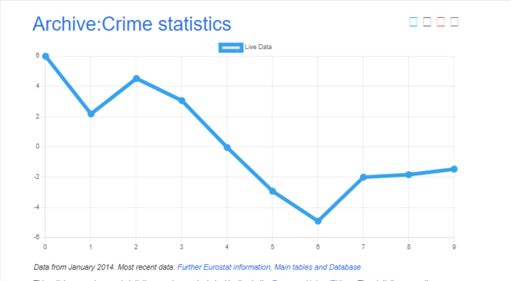
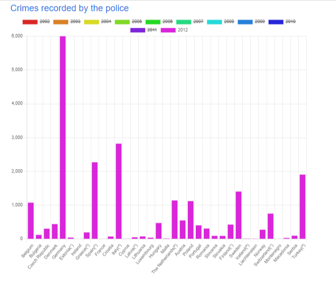
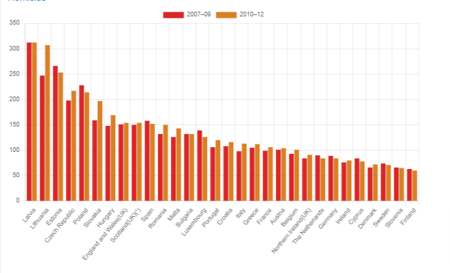

# Data visualisation with Js 📈

This is a practice project to learn more about JavaScript and it's Third-party libraries for display data.

Live Page Link : [Click here](https://alisepar.github.io/js-datavisualisation-challenge/)

## Given Objectives

This consolidation challenge will help you assess your ability to solve a problem inspired from real-life situations using your new javascript muscles involving the following know-hows :

- DOM manipulation
- AJAX/FETCH request
- Using Third-party libraries (chart.js, ToastUi-Chart, D3.js - Data-Driven Documents)
- problem-solving : design a logical solution to implement the expected result
- Debugging using the console
- Understand the notion of "separation of concerns"

## Execution

- To display data i have used **chart.js** for this project.
- For the live chart i had to get live data form api i used Fetch Api in js.
- For the second and third chart i had to get data form html tables using DOM and store(in a object), sort them and then create chart with js and add data then display it in html with DOM.

## ScreenShot

| Live Chart                                                 | First Chart                                                  | Second Chart                                                   |
| ---------------------------------------------------------- | ------------------------------------------------------------ | -------------------------------------------------------------- |
|  |  |  |
